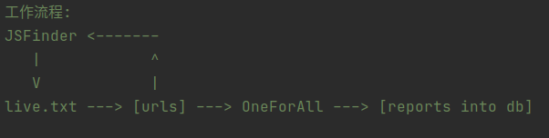
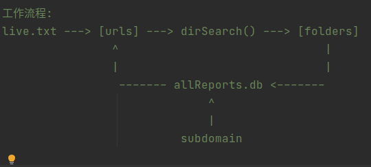
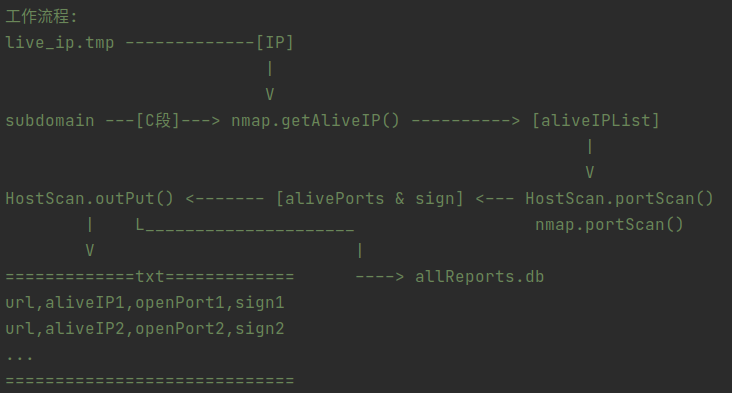
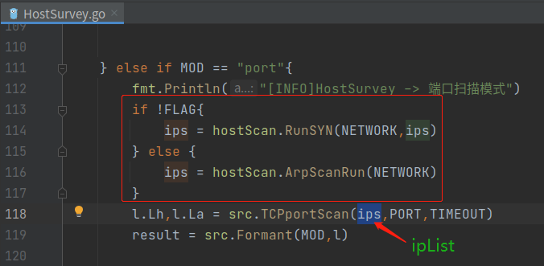
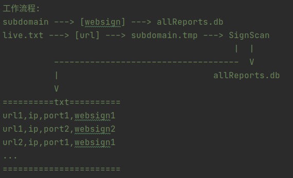
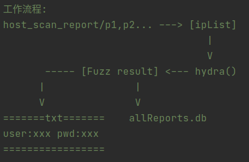
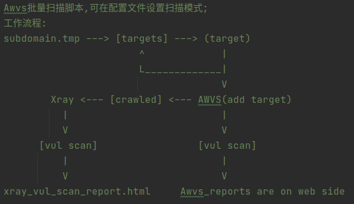
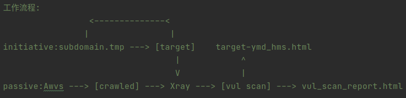

# SutureMonster
这个项目是autoIncient的加强版，和原版相比起来，增加了子域名收集、目录扫描和服务识别模块，支持代理，并且兼容多平台。 

&nbsp;&nbsp;&nbsp;&nbsp;&nbsp;&nbsp;在运行之前需要根据自己情况设置好配置文件 `sutureonster.yml` ，整合的工具本身可能也有配置文件，
但是最终重复项会被 `sutureonster.yml` 覆盖，另外如果要使用xray模块请单独设置xray自己本身的配置文件 `config.yaml`； 

&nbsp;&nbsp;&nbsp;&nbsp;模块下的每个工具都会将结果输出到 `reports/` 目录下，然后SutureMonster会将它们汇总写入sqlite，最后导出到一个 .xls 文件中，
导出路径可以用 `-o` 参数来指定。在第二次运行前建议将reports/目录下的所有结果清除，以免造成数据混乱。 
排除文件夹： 
> reports/
>> dir_scan_report/ 
>> host_scan_report/ 
>> port_fuzz_report/ 
>> subdomain_report/ 
>> vul_scan_report/ 
>> websign_report/ 

整个项目分为7个模块： 

 1.subdomain&nbsp;&nbsp;子域名信息获取 
 2.dirscan&nbsp;&nbsp;&nbsp;&nbsp;&nbsp;&nbsp;&nbsp;&nbsp;目录扫描 
 3.hostscan&nbsp;&nbsp;&nbsp;&nbsp;&nbsp;主机发现&端口扫描 
 4.signscan&nbsp;&nbsp;&nbsp;&nbsp;&nbsp;&nbsp;web服务识别 
 5.xray&nbsp;&nbsp;&nbsp;&nbsp;&nbsp;&nbsp;&nbsp;&nbsp;&nbsp;&nbsp;&nbsp;&nbsp;&nbsp;xray漏洞扫描 
 6.awvs&nbsp;&nbsp;&nbsp;&nbsp;&nbsp;&nbsp;&nbsp;&nbsp;&nbsp;&nbsp;&nbsp;&nbsp;awvs爬虫/漏洞扫描 
 7.hydra&nbsp;&nbsp;&nbsp;&nbsp;&nbsp;&nbsp;&nbsp;&nbsp;&nbsp;&nbsp;&nbsp;hydra弱口令爆破 

每个模块之间可以随意组合，不指定 `-m` 参数则为全选，如果同时存在subdomain和signscan模块，
那么signscan模块不会工作，最终会引用subdomain模块生成的服务器banner信息。 

# Use-Agent
example： 
> python SutureMonster.py -f target.txt 
> python SutureMonster.py -f urls.txt -m awvs xray 
> python SutureMonster.py -u http://example.com -m subdomain dirscan 
> python SutureMonster.py -u 192.168.242.1 -m hostscan hydra 

 

推荐组合： 
-m subdomain dirscan 
-m hostscan signscan hydra 
-m awvs xray 

# 工作流程
* 1.subdomain模块 
 
这个模块功能主要是获取目标子域名信息，引入了JSFindr(魔改版)、OneForAll(输入参数上有一些小改动)。
主要流程为jsfinder先从live.txt读取存活目标url，从js中提取子域名，通过存活性检查后连同原有url一起去重写入live.txt，再启动oneforall进行信息收集，最后将需要的结果写入allReports.db。 

* 2.dirscan模块 
 
这个模块只整合了dirsearch一个工具，用于web目录扫描，在单独运行的模式下目标直接取自live.txt，联动subdomain模块则从数据库中获取subdomain模块生成的结果，扫描完成后会将结果整理好写入数据库。 

* 3.hostscan模块 
 
hostscan模块整合了两个工具，分别是nmap和本人的另一个go的项目HostSurvey，主要功能为c段主机发现、端口扫描、web服务识别。nmap需要将程序放在HostScan/目录下并将文件夹重命名为nmap或者把nmap加入环境变量；如果联动nmap，则会识别端口开放服务，两者结果将结合去重写入数据库。 
模块工作方式分联动subdomain和单独运行两种： 

> 联动模式下目标会取自oneforall收集的c段结果进行扫描 
> 单独运行目标直接从live_ip.txt获取 

获取到目标后先用syn扫描80端口确定服务器存活，再用全连接进行端口扫描，最后结果以端口号为文件名内容为ip的格式输出到reports/host_scan_reprot/，以方便hydra调用目标。在使用HostSurvey扫描的时候需要用到pcap，如果因为各种原因用不了的话可以用.test后缀的编译版本，这个版本的工具不会先去探测主机存活性，而是直接开始端口扫描，如果需要linux版本请自行下载更改然后编译。 
需要更改的地方： 
 

* 4.signscan模块 
 
这个模块的功能是使用HostSurvey的sign模块对网站进行服务的banner识别，其结果和subdomain模块中oneforall的banner识别结果相同，因此在联动模式下这个模块不工作，直接跳过；独立模式下则会启动工具识别网站banner，然后经过处理后写入数据库。 

* 5.hydra模块 
 
这里单独整合了hydra，用于对hostscan模块端口扫描的结果进行针对性爆破，需要先将hydra加入环境变量，或者把程序放在monster/目录下，文件夹重命名为 thc-hydra ；爆破的结果将写入数据库并保存到reports/port_fuzz_report/目录下。 
另外，有生之年会加入验证码绕过模块，同时开启web端用户密码爆破功能。 

* 6.awvs模块 
 
这个模块源自于autoIncient，经过改造后具备主动漏洞扫描功能，并且在扫描结束后会自动删除目标，只需要在配置文件中设置好即可，唯一的不足是主动扫描的报告需要自己上web端下载。目标获取和上面几个模块一样，联动subdomain时会从数据库获取目标，独立模式则会从live.txt获取目标。 

* 7.xray模块 
 
这个模块也是来自autoIncient项目，经过改造后具备主动漏洞扫描功能，输出报告为html，在配置文件中可以设定运行模式和主动模式的结果输出路径，在被动模式下监听来自配置文件中设置的端口的流量，在本项目和awvs配合使用，主动模式下目标获取同awvs。 

# 运行效果
subdomain模块： 
 
dirscan模块： 
 
hostscan + hydra： 
 
xray + awvs： 
 
