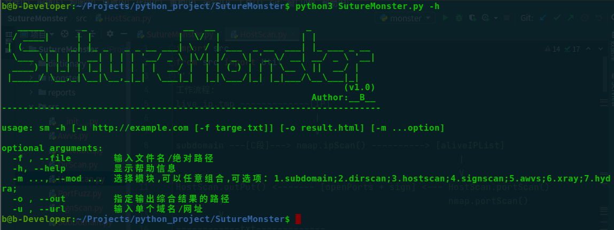
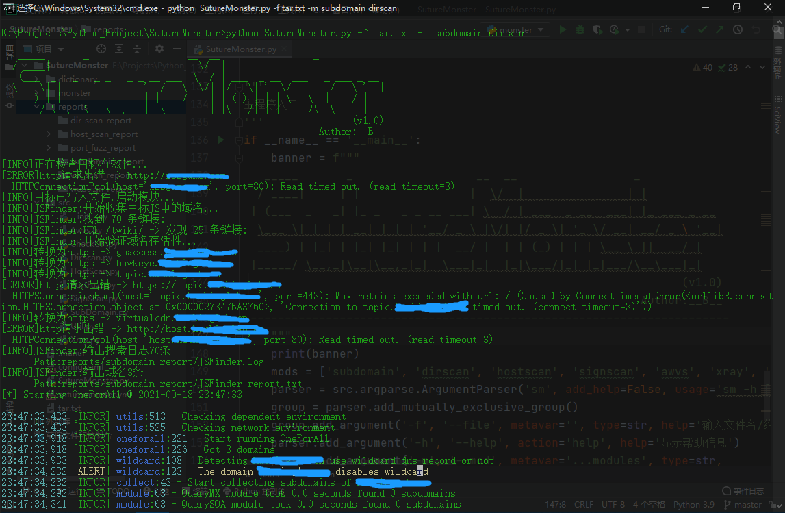
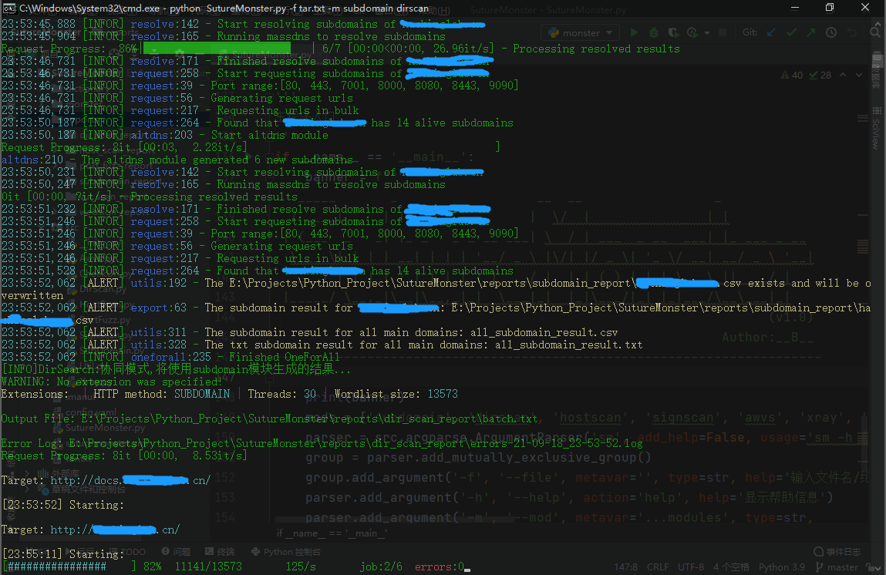
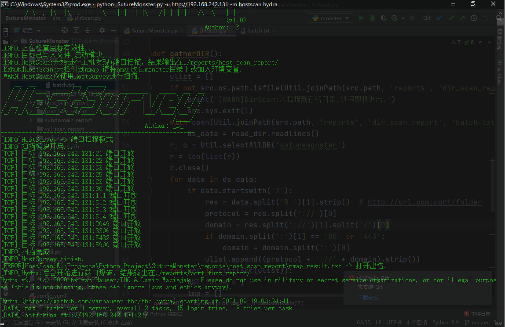
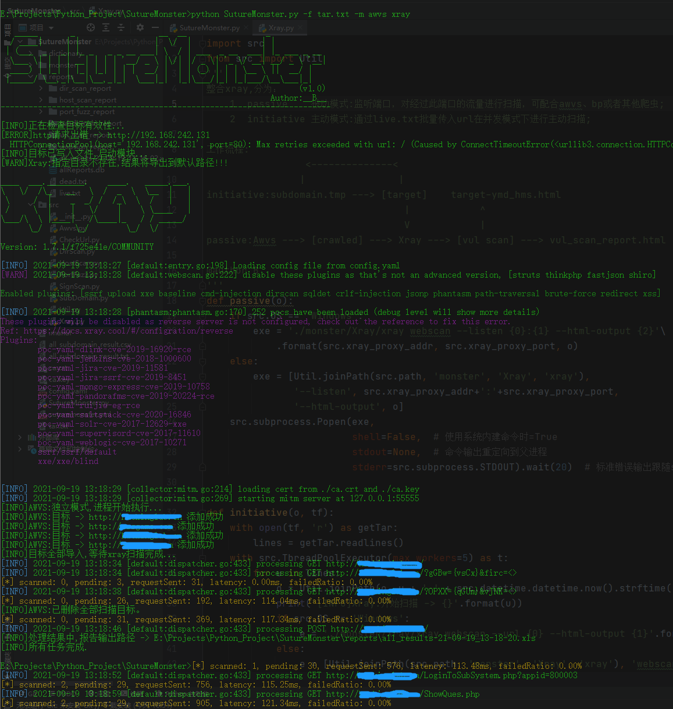

# SutureMonster
这个项目是autoIncient的加强版，和原版相比起来，增加了子域名收集、目录扫描和服务识别模块，并且兼容多平台。 

&nbsp;&nbsp;&nbsp;&nbsp;&nbsp;&nbsp;在运行之前需要根据自己情况设置好配置文件 `sutureonster.yml` ，整合的工具本身可能也有配置文件，
但是最终重复项会被 `sutureonster.yml` 覆盖，另外如果要使用xray模块请单独设置xray自己本身的配置文件 `config.yaml`； 

&nbsp;&nbsp;&nbsp;&nbsp;模块下的每个工具都会将结果输出到 `reports/` 目录下，然后SutureMonster会将它们汇总写入sqlite，最后导出到一个 .xls 文件中，
导出路径可以用 `-o` 参数来指定。在第二次运行前建议将reports/目录下的所有结果清除，以免造成数据混乱。 
排除文件夹： 
> reports/
>> dir_scan_report/ 
>> host_scan_report/ 
>> port_fuzz_report/ 
>> subdomain_report/ 
>> vul_scan_report/ 
>> websign_report/ 
整个项目分为7个模块： 

 1.subdomain&nbsp;&nbsp;子域名信息获取 
 2.dirscan&nbsp;&nbsp;&nbsp;&nbsp;&nbsp;&nbsp;&nbsp;&nbsp;目录扫描 
 3.hostscan&nbsp;&nbsp;&nbsp;&nbsp;&nbsp;主机发现&端口扫描 
 4.signscan&nbsp;&nbsp;&nbsp;&nbsp;&nbsp;&nbsp;web服务识别 
 5.xray&nbsp;&nbsp;&nbsp;&nbsp;&nbsp;&nbsp;&nbsp;&nbsp;&nbsp;&nbsp;&nbsp;&nbsp;&nbsp;xray漏洞扫描 
 6.awvs&nbsp;&nbsp;&nbsp;&nbsp;&nbsp;&nbsp;&nbsp;&nbsp;&nbsp;&nbsp;&nbsp;&nbsp;awvs爬虫/漏洞扫描 
 7.hydra&nbsp;&nbsp;&nbsp;&nbsp;&nbsp;&nbsp;&nbsp;&nbsp;&nbsp;&nbsp;&nbsp;hydra弱口令爆破 

每个模块之间可以随意组合，不指定 `-m` 参数则为全选，如果同时存在subdomain和signscan模块，
那么signscan模块不会工作，最终会引用subdomain模块生成的服务器banner信息。 

# Use-Agent
> python SutureMonster.py -f target.txt 
> python SutureMonster.py -f urls.txt -m awvs xray 
> python SutureMonster.py -u http://example.com -m subdomain dirscan 
> python SutureMonster.py -u 192.168.242.1 -m hostscan hydra 
 
推荐组合： 
-m subdomain dirscan 
-m hostscan signscan hydra 
-m awvs xray 

# 工作流程
1. 

# 运行效果
 
 
 
 
